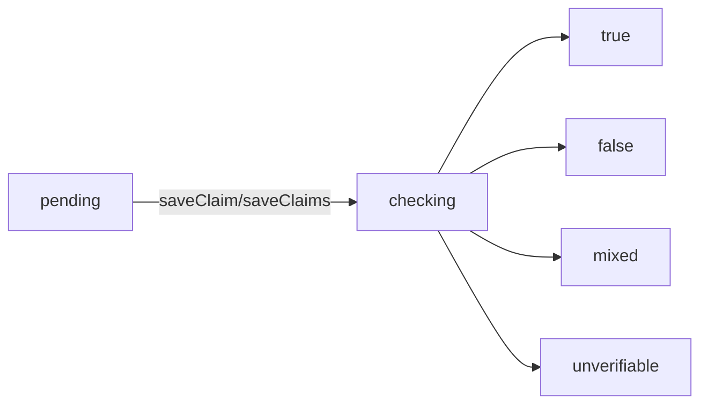

## Overview

The Claims API manages factual claims extracted from debate transcripts. It includes both public queries and internal mutations for the fact-checking pipeline.

**Function Types:**
- **Public Query**: `listByDebate` - accessible from client
- **Internal Mutations**: `saveClaim`, `saveClaims`, `updateStatus` - only callable from Convex actions/mutations
- **Internal Query**: `getById` - only callable from Convex actions/mutations

---

## listByDebate

<CodeGroup>
```typescript Query
import { api } from "@/convex/_generated/api";

const claims = await convex.query(api.claims.listByDebate, {
  debateId: debateId
});
```
</CodeGroup>

Retrieves all claims associated with a specific debate, including their fact-check status and verification results.

### Parameters

<ParamField path="debateId" type="Id<'debates'>" required>
  The ID of the debate to retrieve claims for
</ParamField>

### Returns

<ResponseField name="claims" type="Claim[]">
  Array of all claims for the debate
</ResponseField>

### Claim Object Structure

<ResponseField name="_id" type="Id<'claims'>">
  Unique claim identifier
</ResponseField>

<ResponseField name="_creationTime" type="number">
  Convex automatic creation timestamp
</ResponseField>

<ResponseField name="debateId" type="Id<'debates'>">
  ID of the associated debate
</ResponseField>

<ResponseField name="speaker" type="0 | 1">
  Which speaker made the claim (0 = Speaker A, 1 = Speaker B)
</ResponseField>

<ResponseField name="claimText" type="string">
  The extracted factual claim statement
</ResponseField>

<ResponseField name="originalTranscriptExcerpt" type="string">
  The original transcript text from which the claim was extracted
</ResponseField>

<ResponseField name="status" type="'pending' | 'checking' | 'true' | 'false' | 'mixed' | 'unverifiable'">
  Current fact-checking status of the claim
</ResponseField>

<ResponseField name="verdict" type="string | undefined">
  Human-readable explanation of the fact-check result (optional)
</ResponseField>

<ResponseField name="correction" type="string | undefined">
  Corrected version of the claim if it was false or mixed (optional)
</ResponseField>

<ResponseField name="sources" type="string[] | undefined">
  Array of source URLs used for fact-checking (optional)
</ResponseField>

<ResponseField name="extractedAt" type="number">
  Unix timestamp when claim was extracted from transcript
</ResponseField>

<ResponseField name="checkedAt" type="number | undefined">
  Unix timestamp when fact-check was completed (optional)
</ResponseField>

---

## saveClaims

<CodeGroup>
```typescript Internal Mutation
import { internal } from "@/convex/_generated/api";

await ctx.runMutation(internal.claims.saveClaims, {
  claims: [
    {
      debateId: debateId,
      speaker: 0,
      claimText: "The economy grew by 5% last year",
      originalTranscriptExcerpt: "As I said, the economy grew by 5% last year..."
    },
    {
      debateId: debateId,
      speaker: 1,
      claimText: "Unemployment is at a record low",
      originalTranscriptExcerpt: "Well, unemployment is at a record low..."
    }
  ]
});
```
</CodeGroup>

Internal mutation to batch-save multiple claims and trigger fact-checking for each.

### Parameters

<ParamField path="claims" type="array" required>
  Array of claim objects to save
</ParamField>

<ParamField path="claims[].debateId" type="Id<'debates'>" required>
  The debate this claim belongs to
</ParamField>

<ParamField path="claims[].speaker" type="0 | 1" required>
  Which speaker made the claim
</ParamField>

<ParamField path="claims[].claimText" type="string" required>
  The extracted claim text
</ParamField>

<ParamField path="claims[].originalTranscriptExcerpt" type="string" required>
  Original transcript excerpt
</ParamField>

### Returns

<ResponseField name="return" type="null">
  Returns null on success
</ResponseField>

### Behavior

1. Inserts each claim with status `"pending"`
2. Sets `extractedAt` to `Date.now()`
3. Schedules `internal.factCheck.check` for each claim immediately

---

## saveClaim

<CodeGroup>
```typescript Internal Mutation
import { internal } from "@/convex/_generated/api";

await ctx.runMutation(internal.claims.saveClaim, {
  debateId: debateId,
  speaker: 0,
  claimText: "The economy grew by 5% last year",
  originalTranscriptExcerpt: "As I said, the economy grew by 5% last year..."
});
```
</CodeGroup>

Internal mutation to save a single claim and trigger fact-checking.

### Parameters

<ParamField path="debateId" type="Id<'debates'>" required>
  The debate this claim belongs to
</ParamField>

<ParamField path="speaker" type="0 | 1" required>
  Which speaker made the claim (0 or 1)
</ParamField>

<ParamField path="claimText" type="string" required>
  The extracted factual claim
</ParamField>

<ParamField path="originalTranscriptExcerpt" type="string" required>
  The original transcript text
</ParamField>

### Returns

<ResponseField name="return" type="null">
  Returns null on success
</ResponseField>

### Behavior

Identical to `saveClaims` but for a single claim:
1. Inserts claim with status `"pending"`
2. Sets `extractedAt` timestamp
3. Schedules immediate fact-check

---

## getById

<CodeGroup>
```typescript Internal Query
import { internal } from "@/convex/_generated/api";

const claim = await ctx.runQuery(internal.claims.getById, {
  claimId: claimId
});
```
</CodeGroup>

Internal query to retrieve a single claim by ID.

### Parameters

<ParamField path="claimId" type="Id<'claims'>" required>
  The ID of the claim to retrieve
</ParamField>

### Returns

<ResponseField name="claim" type="Claim | null">
  The claim object or null if not found
</ResponseField>

---

## updateStatus

<CodeGroup>
```typescript Internal Mutation
import { internal } from "@/convex/_generated/api";

await ctx.runMutation(internal.claims.updateStatus, {
  claimId: claimId,
  status: "true",
  verdict: "This claim is accurate according to official statistics.",
  sources: [
    "https://example.gov/stats",
    "https://example.org/report"
  ]
});
```
</CodeGroup>

Internal mutation to update a claim's fact-checking status and results.

### Parameters

<ParamField path="claimId" type="Id<'claims'>" required>
  The ID of the claim to update
</ParamField>

<ParamField path="status" type="'checking' | 'true' | 'false' | 'mixed' | 'unverifiable'" required>
  The new status (cannot be set back to "pending")
</ParamField>

<ParamField path="verdict" type="string">
  Explanation of the fact-check result
</ParamField>

<ParamField path="correction" type="string">
  Corrected version of the claim (typically used for "false" or "mixed" status)
</ParamField>

<ParamField path="sources" type="string[]">
  Array of source URLs used for verification
</ParamField>

### Returns

<ResponseField name="return" type="null">
  Returns null on success
</ResponseField>

### Behavior

- Automatically sets `checkedAt` to `Date.now()`
- Updates all provided fields

---

## Status Flow



### Status Definitions

- **pending**: Claim extracted, awaiting fact-check
- **checking**: Fact-check in progress
- **true**: Claim verified as accurate
- **false**: Claim verified as inaccurate
- **mixed**: Claim partially true/false
- **unverifiable**: Cannot be verified with available sources

---

## Validation Schema

```typescript
const claimValidator = v.object({
  _id: v.id("claims"),
  _creationTime: v.number(),
  debateId: v.id("debates"),
  speaker: v.union(v.literal(0), v.literal(1)),
  claimText: v.string(),
  originalTranscriptExcerpt: v.string(),
  status: v.union(
    v.literal("pending"),
    v.literal("checking"),
    v.literal("true"),
    v.literal("false"),
    v.literal("mixed"),
    v.literal("unverifiable"),
  ),
  verdict: v.optional(v.string()),
  correction: v.optional(v.string()),
  sources: v.optional(v.array(v.string())),
  extractedAt: v.number(),
  checkedAt: v.optional(v.number()),
})
```
