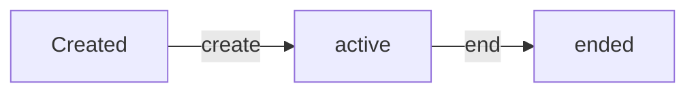

## Overview

The Debates API provides functions to create, end, retrieve, and list debate sessions. All mutations require user authentication via Convex Auth.

---

## create

<CodeGroup>
```typescript Mutation
import { api } from "@/convex/_generated/api";

const debateId = await convex.mutation(api.debates.create, {
  speakerAName: "Alice",
  speakerBName: "Bob"
});
```
</CodeGroup>

Creates a new debate session with two speakers. The debate is automatically set to "active" status and associated with the authenticated user.

### Parameters

<ParamField path="speakerAName" type="string" required>
  Name of the first speaker in the debate
</ParamField>

<ParamField path="speakerBName" type="string" required>
  Name of the second speaker in the debate
</ParamField>

### Returns

<ResponseField name="debateId" type="Id<'debates'>">
  The unique identifier for the newly created debate
</ResponseField>

### Authentication

Requires authenticated user. Throws `Error("Not authenticated")` if user is not logged in.

### Behavior

- Sets initial status to `"active"`
- Records `startedAt` timestamp using `Date.now()`
- Associates debate with current authenticated user's ID

---

## end

<CodeGroup>
```typescript Mutation
import { api } from "@/convex/_generated/api";

await convex.mutation(api.debates.end, {
  debateId: debateId
});
```
</CodeGroup>

Ends an active debate session and triggers claim extraction from the transcript.

### Parameters

<ParamField path="debateId" type="Id<'debates'>" required>
  The ID of the debate to end
</ParamField>

### Returns

<ResponseField name="return" type="null">
  Returns null on success
</ResponseField>

### Authentication

Requires authenticated user who owns the debate. Throws:
- `Error("Not authenticated")` if user is not logged in
- `Error("Not found")` if debate doesn't exist or user doesn't own it

### Behavior

1. Validates user owns the debate
2. Updates debate status to `"ended"`
3. Records `endedAt` timestamp
4. Schedules `internal.claimExtraction.extract` to run immediately

---

## get

<CodeGroup>
```typescript Query
import { api } from "@/convex/_generated/api";

const debate = await convex.query(api.debates.get, {
  debateId: debateId
});
```
</CodeGroup>

Retrieves a single debate by ID. No authentication required - debates are publicly readable.

### Parameters

<ParamField path="debateId" type="Id<'debates'>" required>
  The ID of the debate to retrieve
</ParamField>

### Returns

<ResponseField name="debate" type="Debate | null">
  The debate object or null if not found
</ResponseField>

### Debate Object Structure

<ResponseField name="_id" type="Id<'debates'>">
  Unique debate identifier
</ResponseField>

<ResponseField name="_creationTime" type="number">
  Convex automatic creation timestamp
</ResponseField>

<ResponseField name="userId" type="Id<'users'>">
  ID of the user who created the debate
</ResponseField>

<ResponseField name="speakerAName" type="string">
  Name of speaker A
</ResponseField>

<ResponseField name="speakerBName" type="string">
  Name of speaker B
</ResponseField>

<ResponseField name="status" type="'active' | 'ended'">
  Current debate status
</ResponseField>

<ResponseField name="startedAt" type="number">
  Unix timestamp when debate started
</ResponseField>

<ResponseField name="endedAt" type="number | undefined">
  Unix timestamp when debate ended (optional, only present for ended debates)
</ResponseField>

---

## list

<CodeGroup>
```typescript Query
import { api } from "@/convex/_generated/api";

const debates = await convex.query(api.debates.list, {});
```
</CodeGroup>

Lists all debates for the authenticated user, ordered by most recent first.

### Parameters

No parameters required.

### Returns

<ResponseField name="debates" type="Debate[]">
  Array of debate objects owned by the current user, ordered by creation time (descending)
</ResponseField>

### Authentication

Optional. Returns empty array `[]` if user is not authenticated.

### Behavior

- Uses `by_user` index for efficient querying
- Returns debates in descending order (newest first)
- Only returns debates owned by the authenticated user

---

## Validation Schema

The debate validator used for type safety:

```typescript
const debateValidator = v.object({
  _id: v.id("debates"),
  _creationTime: v.number(),
  userId: v.id("users"),
  speakerAName: v.string(),
  speakerBName: v.string(),
  status: v.union(v.literal("active"), v.literal("ended")),
  startedAt: v.number(),
  endedAt: v.optional(v.number()),
})
```

---

## Status Transitions



- Debates start as `"active"` when created
- Only transition is from `"active"` to `"ended"` via the `end` mutation
- Ended debates cannot be reactivated
