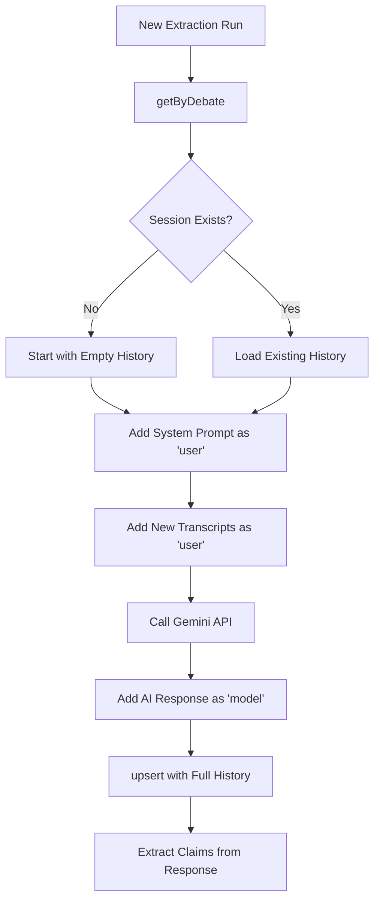

## Overview

The Extraction Sessions API maintains conversation history for Gemini AI during claim extraction. It enables multi-turn context by storing the complete message history between the user (system prompts + transcripts) and the AI model (claim extraction responses).

This allows the claim extraction process to maintain context across multiple extraction runs, improving accuracy and consistency.

**Function Types:**
- **Internal Query**: `getByDebate`
- **Internal Mutation**: `upsert`

---

## getByDebate

<CodeGroup>
```typescript Internal Query
import { internal } from "@/convex/_generated/api";

const session = await ctx.runQuery(internal.extractionSessions.getByDebate, {
  debateId: debateId
});

if (session) {
  // Continue existing conversation
  const history = session.messages;
} else {
  // Start new conversation
  const history = [];
}
```
</CodeGroup>

Internal query to retrieve the extraction session history for a specific debate.

### Parameters

<ParamField path="debateId" type="Id<'debates'>" required>
  The ID of the debate to retrieve the session for
</ParamField>

### Returns

<ResponseField name="session" type="ExtractionSession | null">
  The session object containing message history, or null if no session exists yet
</ResponseField>

### Session Object Structure

<ResponseField name="_id" type="Id<'extractionSessions'>">
  Unique session identifier
</ResponseField>

<ResponseField name="_creationTime" type="number">
  Convex automatic creation timestamp
</ResponseField>

<ResponseField name="debateId" type="Id<'debates'>">
  ID of the associated debate
</ResponseField>

<ResponseField name="messages" type="Message[]">
  Array of conversation messages in chronological order
</ResponseField>

### Message Object Structure

<ResponseField name="role" type="'user' | 'model'">
  The role of the message sender:
  - `"user"`: System prompts and transcript inputs
  - `"model"`: Gemini AI responses with extracted claims
</ResponseField>

<ResponseField name="content" type="string">
  The message content (prompt text or AI response)
</ResponseField>

### Behavior

- Uses `by_debate` index for efficient lookup
- Returns first (and only) session for the debate
- Returns `null` if no session has been created yet

---

## upsert

<CodeGroup>
```typescript Internal Mutation
import { internal } from "@/convex/_generated/api";

// Get existing session
const session = await ctx.runQuery(internal.extractionSessions.getByDebate, {
  debateId: debateId
});

// Build updated message history
const messages = [
  ...(session?.messages || []),
  {
    role: "user" as const,
    content: "New transcript: Speaker A said..."
  },
  {
    role: "model" as const,
    content: '{"claims": [...]}'
  }
];

// Save updated session
await ctx.runMutation(internal.extractionSessions.upsert, {
  debateId: debateId,
  messages: messages
});
```
</CodeGroup>

Internal mutation to create or update the extraction session history for a debate.

### Parameters

<ParamField path="debateId" type="Id<'debates'>" required>
  The ID of the debate
</ParamField>

<ParamField path="messages" type="Message[]" required>
  The complete array of messages representing the conversation history
</ParamField>

<ParamField path="messages[].role" type="'user' | 'model'" required>
  The role of each message
</ParamField>

<ParamField path="messages[].content" type="string" required>
  The content of each message
</ParamField>

### Returns

<ResponseField name="return" type="null">
  Returns null on success
</ResponseField>

### Behavior

1. Queries for existing session using `by_debate` index
2. If session exists:
   - Updates the existing session's `messages` array via `patch`
3. If session doesn't exist:
   - Creates new session with provided messages via `insert`
4. Replaces entire message array (not append)

<Note>
The `upsert` function replaces the entire message array. To append messages, you must:
1. Fetch existing session with `getByDebate`
2. Concatenate new messages to existing array
3. Call `upsert` with complete array
</Note>

---

## Message Validation Schema

```typescript
const messageValidator = v.object({
  role: v.union(v.literal("user"), v.literal("model")),
  content: v.string(),
})
```

---

## Usage Pattern

The typical flow for maintaining extraction context:



### Example Flow

**First Extraction:**
```typescript
// No session exists yet
const session = await ctx.runQuery(internal.extractionSessions.getByDebate, {
  debateId
}); // Returns null

const messages = [
  { role: "user", content: "Extract claims from: [transcript 1]" },
  { role: "model", content: '{"claims": ["claim 1"]}' }
];

await ctx.runMutation(internal.extractionSessions.upsert, {
  debateId,
  messages
});
```

**Second Extraction (with context):**
```typescript
// Session now exists
const session = await ctx.runQuery(internal.extractionSessions.getByDebate, {
  debateId
});

const messages = [
  ...session.messages, // Previous context
  { role: "user", content: "Extract claims from: [transcript 2]" },
  { role: "model", content: '{"claims": ["claim 2"]}' }
];

await ctx.runMutation(internal.extractionSessions.upsert, {
  debateId,
  messages
});
```

---

## Benefits of Session History

1. **Contextual Awareness**: Gemini can reference previously extracted claims
2. **Consistency**: Maintains consistent claim formatting and extraction patterns
3. **Deduplication**: AI can avoid extracting duplicate claims
4. **Progressive Refinement**: Model learns debate-specific patterns
5. **Multi-turn Reasoning**: Enables complex extraction across multiple passes

---

## Database Relationship

- One-to-one relationship: Each debate has at most one extraction session
- Session persists across multiple extraction runs
- Session is never deleted (maintains full history)
- Indexed by `debateId` for efficient lookups
