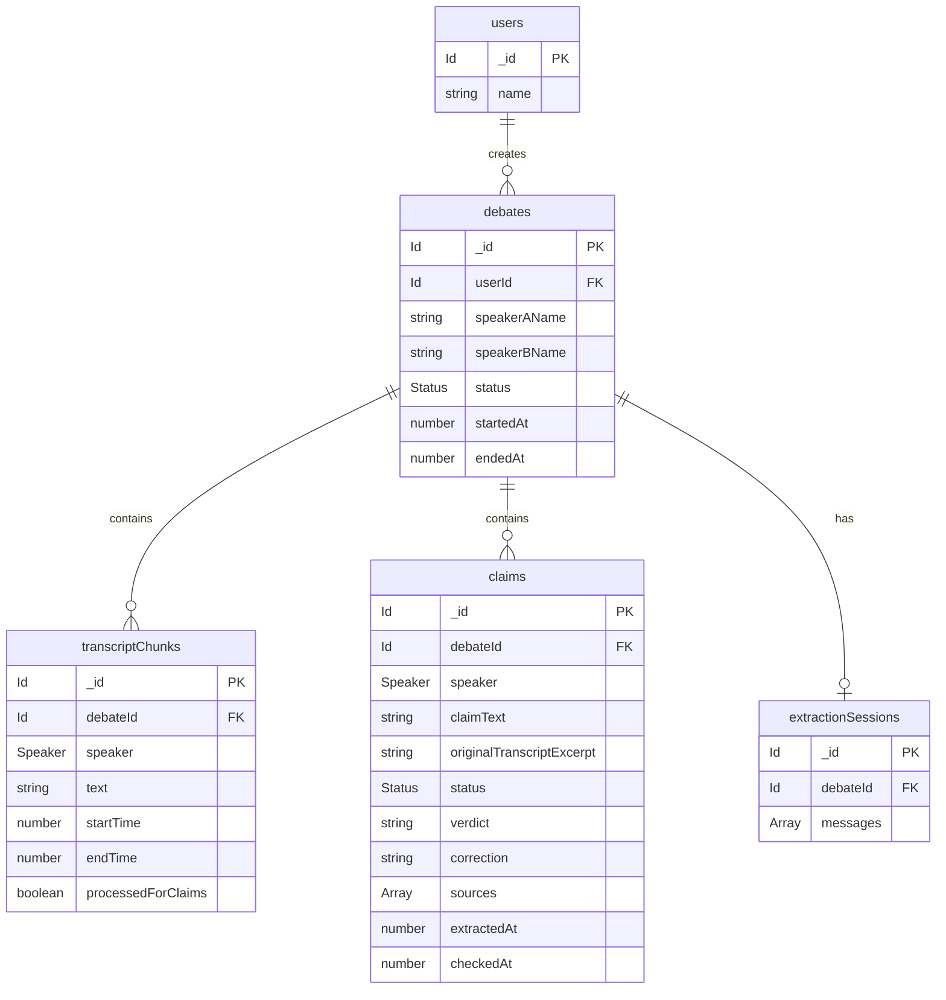

## Overview

Stanzo's Convex database schema defines four core tables for managing debates, transcripts, claims, and AI extraction sessions. The schema uses Convex's built-in authentication tables and defines custom tables with indexes for efficient querying.

---

## Schema Definition

<CodeGroup>
```typescript schema.ts
import { authTables } from "@convex-dev/auth/server"
import { defineSchema, defineTable } from "convex/server"
import { v } from "convex/values"

export default defineSchema({
  ...authTables,

  debates: defineTable({
    userId: v.id("users"),
    speakerAName: v.string(),
    speakerBName: v.string(),
    status: v.union(v.literal("active"), v.literal("ended")),
    startedAt: v.number(),
    endedAt: v.optional(v.number()),
  })
    .index("by_user", ["userId"])
    .index("by_user_and_status", ["userId", "status"]),

  transcriptChunks: defineTable({
    debateId: v.id("debates"),
    speaker: v.union(v.literal(0), v.literal(1)),
    text: v.string(),
    startTime: v.number(),
    endTime: v.number(),
    processedForClaims: v.boolean(),
  })
    .index("by_debate", ["debateId"])
    .index("by_debate_and_time", ["debateId", "startTime"])
    .index("by_debate_unprocessed", ["debateId", "processedForClaims"]),

  claims: defineTable({
    debateId: v.id("debates"),
    speaker: v.union(v.literal(0), v.literal(1)),
    claimText: v.string(),
    originalTranscriptExcerpt: v.string(),
    status: v.union(
      v.literal("pending"),
      v.literal("checking"),
      v.literal("true"),
      v.literal("false"),
      v.literal("mixed"),
      v.literal("unverifiable"),
    ),
    verdict: v.optional(v.string()),
    correction: v.optional(v.string()),
    sources: v.optional(v.array(v.string())),
    extractedAt: v.number(),
    checkedAt: v.optional(v.number()),
  })
    .index("by_debate", ["debateId"])
    .index("by_debate_and_status", ["debateId", "status"])
    .index("by_status", ["status"]),

  extractionSessions: defineTable({
    debateId: v.id("debates"),
    messages: v.array(
      v.object({
        role: v.union(v.literal("user"), v.literal("model")),
        content: v.string(),
      }),
    ),
  }).index("by_debate", ["debateId"]),
})
```
</CodeGroup>

---

## Tables

### debates

Stores debate sessions with speaker information and status tracking.

#### Fields

<ResponseField name="userId" type="Id<'users'>" required>
  Reference to the user who created the debate (from Convex Auth)
</ResponseField>

<ResponseField name="speakerAName" type="string" required>
  Display name for the first speaker
</ResponseField>

<ResponseField name="speakerBName" type="string" required>
  Display name for the second speaker
</ResponseField>

<ResponseField name="status" type="'active' | 'ended'" required>
  Current debate status:
  - `"active"`: Debate is ongoing
  - `"ended"`: Debate has concluded
</ResponseField>

<ResponseField name="startedAt" type="number" required>
  Unix timestamp (milliseconds) when debate began
</ResponseField>

<ResponseField name="endedAt" type="number">
  Unix timestamp (milliseconds) when debate ended (optional, only set when status is "ended")
</ResponseField>

#### Indexes

<ResponseField name="by_user" type="[userId]">
  Enables efficient queries for all debates by a specific user
</ResponseField>

<ResponseField name="by_user_and_status" type="[userId, status]">
  Enables efficient queries for user's active or ended debates
</ResponseField>

---

### transcriptChunks

Stores real-time speech-to-text segments with timing and processing status.

#### Fields

<ResponseField name="debateId" type="Id<'debates'>" required>
  Reference to the parent debate
</ResponseField>

<ResponseField name="speaker" type="0 | 1" required>
  Which speaker produced this chunk:
  - `0`: Speaker A
  - `1`: Speaker B
</ResponseField>

<ResponseField name="text" type="string" required>
  The transcribed text content
</ResponseField>

<ResponseField name="startTime" type="number" required>
  Unix timestamp (milliseconds) when speech segment started
</ResponseField>

<ResponseField name="endTime" type="number" required>
  Unix timestamp (milliseconds) when speech segment ended
</ResponseField>

<ResponseField name="processedForClaims" type="boolean" required>
  Whether this chunk has been analyzed for claim extraction:
  - `false`: Not yet processed
  - `true`: Already processed, skip in future extractions
</ResponseField>

#### Indexes

<ResponseField name="by_debate" type="[debateId]">
  Retrieves all chunks for a debate
</ResponseField>

<ResponseField name="by_debate_and_time" type="[debateId, startTime]">
  Retrieves chunks for a debate in chronological order
</ResponseField>

<ResponseField name="by_debate_unprocessed" type="[debateId, processedForClaims]">
  Efficiently finds unprocessed chunks for claim extraction
</ResponseField>

---

### claims

Stores extracted factual claims with fact-checking results.

#### Fields

<ResponseField name="debateId" type="Id<'debates'>" required>
  Reference to the parent debate
</ResponseField>

<ResponseField name="speaker" type="0 | 1" required>
  Which speaker made the claim:
  - `0`: Speaker A
  - `1`: Speaker B
</ResponseField>

<ResponseField name="claimText" type="string" required>
  The extracted factual claim statement
</ResponseField>

<ResponseField name="originalTranscriptExcerpt" type="string" required>
  The original transcript text from which the claim was extracted
</ResponseField>

<ResponseField name="status" type="Status" required>
  Current fact-checking status:
  - `"pending"`: Awaiting fact-check
  - `"checking"`: Fact-check in progress
  - `"true"`: Verified as accurate
  - `"false"`: Verified as inaccurate
  - `"mixed"`: Partially true/false
  - `"unverifiable"`: Cannot be verified
</ResponseField>

<ResponseField name="verdict" type="string">
  Human-readable explanation of the fact-check result (optional)
</ResponseField>

<ResponseField name="correction" type="string">
  Corrected version of the claim if it was false or mixed (optional)
</ResponseField>

<ResponseField name="sources" type="string[]">
  Array of source URLs used for fact-checking (optional)
</ResponseField>

<ResponseField name="extractedAt" type="number" required>
  Unix timestamp (milliseconds) when claim was extracted
</ResponseField>

<ResponseField name="checkedAt" type="number">
  Unix timestamp (milliseconds) when fact-check completed (optional)
</ResponseField>

#### Indexes

<ResponseField name="by_debate" type="[debateId]">
  Retrieves all claims for a debate
</ResponseField>

<ResponseField name="by_debate_and_status" type="[debateId, status]">
  Retrieves claims for a debate filtered by status (e.g., all pending claims)
</ResponseField>

<ResponseField name="by_status" type="[status]">
  Retrieves all claims with a specific status across all debates
</ResponseField>

---

### extractionSessions

Stores Gemini AI conversation history for multi-turn claim extraction context.

#### Fields

<ResponseField name="debateId" type="Id<'debates'>" required>
  Reference to the parent debate (one-to-one relationship)
</ResponseField>

<ResponseField name="messages" type="Message[]" required>
  Array of conversation messages in chronological order
</ResponseField>

<ResponseField name="messages[].role" type="'user' | 'model'" required>
  The role of each message:
  - `"user"`: System prompts and transcript inputs
  - `"model"`: Gemini AI responses with extracted claims
</ResponseField>

<ResponseField name="messages[].content" type="string" required>
  The message content (prompt text or AI response)
</ResponseField>

#### Indexes

<ResponseField name="by_debate" type="[debateId]">
  Retrieves the session for a specific debate (at most one per debate)
</ResponseField>

---

## Authentication Tables

Stanzo uses `@convex-dev/auth` which automatically provides:

- **users**: User accounts and profiles
- **authSessions**: Active authentication sessions
- **authAccounts**: OAuth provider connections
- **authRefreshTokens**: Token refresh management
- **authVerificationCodes**: Email/phone verification codes
- **authRateLimits**: Rate limiting for auth operations

See the [@convex-dev/auth documentation](https://labs.convex.dev/auth) for details.

---

## Relationships



### Relationship Details

- **users → debates**: One-to-many (user can create multiple debates)
- **debates → transcriptChunks**: One-to-many (debate contains multiple transcript chunks)
- **debates → claims**: One-to-many (debate contains multiple claims)
- **debates → extractionSessions**: One-to-one (debate has at most one extraction session)

---

## Type Definitions

### Speaker Type

```typescript
type Speaker = 0 | 1
```

- `0`: Speaker A
- `1`: Speaker B

### Debate Status

```typescript
type DebateStatus = "active" | "ended"
```

### Claim Status

```typescript
type ClaimStatus = 
  | "pending"       // Awaiting fact-check
  | "checking"      // Fact-check in progress
  | "true"          // Verified accurate
  | "false"         // Verified inaccurate
  | "mixed"         // Partially true/false
  | "unverifiable"  // Cannot be verified
```

### Message Role

```typescript
type MessageRole = "user" | "model"
```

---

## Index Usage Examples

### Query user's active debates
```typescript
ctx.db
  .query("debates")
  .withIndex("by_user_and_status", q => 
    q.eq("userId", userId).eq("status", "active")
  )
  .collect()
```

### Get unprocessed transcript chunks
```typescript
ctx.db
  .query("transcriptChunks")
  .withIndex("by_debate_unprocessed", q =>
    q.eq("debateId", debateId).eq("processedForClaims", false)
  )
  .collect()
```

### Get pending claims across all debates
```typescript
ctx.db
  .query("claims")
  .withIndex("by_status", q => q.eq("status", "pending"))
  .collect()
```

### Get chunks in chronological order
```typescript
ctx.db
  .query("transcriptChunks")
  .withIndex("by_debate_and_time", q => q.eq("debateId", debateId))
  .collect()
```
