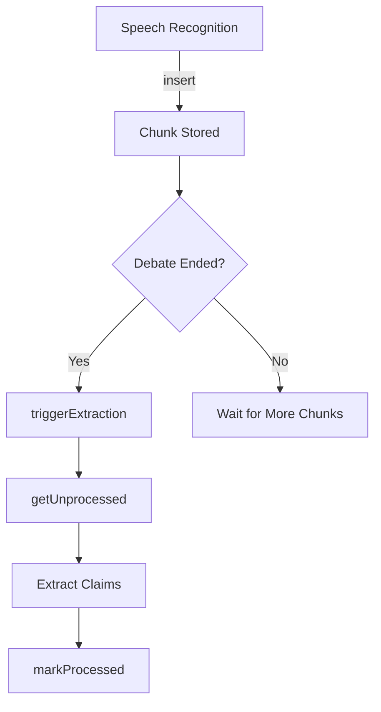

## Overview

The Transcript Chunks API handles storage and retrieval of speech-to-text chunks during live debates. Each chunk represents a segment of speech with precise timing information and tracks whether it has been processed for claim extraction.

**Function Types:**
- **Public Mutations**: `insert`, `triggerExtraction`
- **Public Query**: `listByDebate`
- **Internal Query**: `getUnprocessed`
- **Internal Mutation**: `markProcessed`

---

## insert

<CodeGroup>
```typescript Mutation
import { api } from "@/convex/_generated/api";

await convex.mutation(api.transcriptChunks.insert, {
  debateId: debateId,
  speaker: 0,
  text: "I believe the economy has grown significantly over the past year.",
  startTime: 1234567890,
  endTime: 1234567895
});
```
</CodeGroup>

Inserts a new transcript chunk into the database. Used during live transcription to store speech segments as they are recognized.

### Parameters

<ParamField path="debateId" type="Id<'debates'>" required>
  The ID of the debate this transcript belongs to
</ParamField>

<ParamField path="speaker" type="0 | 1" required>
  Which speaker is talking (0 = Speaker A, 1 = Speaker B)
</ParamField>

<ParamField path="text" type="string" required>
  The transcribed text content
</ParamField>

<ParamField path="startTime" type="number" required>
  Unix timestamp (milliseconds) when this speech segment started
</ParamField>

<ParamField path="endTime" type="number" required>
  Unix timestamp (milliseconds) when this speech segment ended
</ParamField>

### Returns

<ResponseField name="return" type="null">
  Returns null on success
</ResponseField>

### Behavior

- Automatically sets `processedForClaims` to `false`
- Chunks are ready for claim extraction processing

---

## triggerExtraction

<CodeGroup>
```typescript Mutation
import { api } from "@/convex/_generated/api";

await convex.mutation(api.transcriptChunks.triggerExtraction, {
  debateId: debateId
});
```
</CodeGroup>

Manually triggers claim extraction for a debate. Schedules the claim extraction action to run immediately.

### Parameters

<ParamField path="debateId" type="Id<'debates'>" required>
  The ID of the debate to process
</ParamField>

### Returns

<ResponseField name="return" type="null">
  Returns null on success
</ResponseField>

### Behavior

- Schedules `internal.claimExtraction.extract` to run immediately (0ms delay)
- Does not wait for extraction to complete
- Can be called multiple times safely

---

## listByDebate

<CodeGroup>
```typescript Query
import { api } from "@/convex/_generated/api";

const chunks = await convex.query(api.transcriptChunks.listByDebate, {
  debateId: debateId
});
```
</CodeGroup>

Retrieves all transcript chunks for a specific debate, ordered by time.

### Parameters

<ParamField path="debateId" type="Id<'debates'>" required>
  The ID of the debate to retrieve transcripts for
</ParamField>

### Returns

<ResponseField name="chunks" type="TranscriptChunk[]">
  Array of all transcript chunks for the debate
</ResponseField>

### Chunk Object Structure

<ResponseField name="_id" type="Id<'transcriptChunks'>">
  Unique chunk identifier
</ResponseField>

<ResponseField name="_creationTime" type="number">
  Convex automatic creation timestamp
</ResponseField>

<ResponseField name="debateId" type="Id<'debates'>">
  ID of the associated debate
</ResponseField>

<ResponseField name="speaker" type="0 | 1">
  Which speaker produced this chunk (0 = Speaker A, 1 = Speaker B)
</ResponseField>

<ResponseField name="text" type="string">
  The transcribed text content
</ResponseField>

<ResponseField name="startTime" type="number">
  Unix timestamp when speech segment started
</ResponseField>

<ResponseField name="endTime" type="number">
  Unix timestamp when speech segment ended
</ResponseField>

<ResponseField name="processedForClaims" type="boolean">
  Whether this chunk has been processed for claim extraction
</ResponseField>

### Behavior

- Uses `by_debate_and_time` index for efficient querying
- Results ordered by start time (implicit from index)

---

## getUnprocessed

<CodeGroup>
```typescript Internal Query
import { internal } from "@/convex/_generated/api";

const unprocessed = await ctx.runQuery(internal.transcriptChunks.getUnprocessed, {
  debateId: debateId
});
```
</CodeGroup>

Internal query to retrieve all transcript chunks that haven't been processed for claim extraction.

### Parameters

<ParamField path="debateId" type="Id<'debates'>" required>
  The ID of the debate
</ParamField>

### Returns

<ResponseField name="chunks" type="TranscriptChunk[]">
  Array of unprocessed chunks (where `processedForClaims === false`)
</ResponseField>

### Behavior

- Uses `by_debate_unprocessed` compound index for efficient filtering
- Only returns chunks with `processedForClaims: false`

---

## markProcessed

<CodeGroup>
```typescript Internal Mutation
import { internal } from "@/convex/_generated/api";

await ctx.runMutation(internal.transcriptChunks.markProcessed, {
  chunkIds: [chunkId1, chunkId2, chunkId3]
});
```
</CodeGroup>

Internal mutation to mark multiple transcript chunks as processed for claim extraction.

### Parameters

<ParamField path="chunkIds" type="Id<'transcriptChunks'>[]" required>
  Array of chunk IDs to mark as processed
</ParamField>

### Returns

<ResponseField name="return" type="null">
  Returns null on success
</ResponseField>

### Behavior

- Sets `processedForClaims: true` for each provided chunk ID
- Processes chunks sequentially in a loop
- Prevents duplicate claim extraction from same chunks

---

## Validation Schema

```typescript
const chunkValidator = v.object({
  _id: v.id("transcriptChunks"),
  _creationTime: v.number(),
  debateId: v.id("debates"),
  speaker: v.union(v.literal(0), v.literal(1)),
  text: v.string(),
  startTime: v.number(),
  endTime: v.number(),
  processedForClaims: v.boolean(),
})
```

---

## Processing Flow



### Typical Usage Pattern

1. **During Debate**: Call `insert` for each speech segment as it's transcribed
2. **Periodic or End**: Call `triggerExtraction` to process accumulated chunks
3. **Extraction Action**: Uses `getUnprocessed` to fetch new chunks
4. **After Processing**: Calls `markProcessed` to prevent reprocessing

---

## Timing Information

The `startTime` and `endTime` fields enable:
- Precise temporal tracking of when claims were made
- Synchronization with audio/video playback
- Time-based analysis of debate flow
- Chronological ordering of transcript segments
