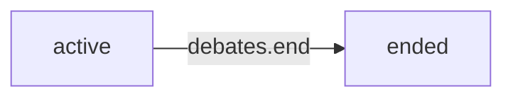
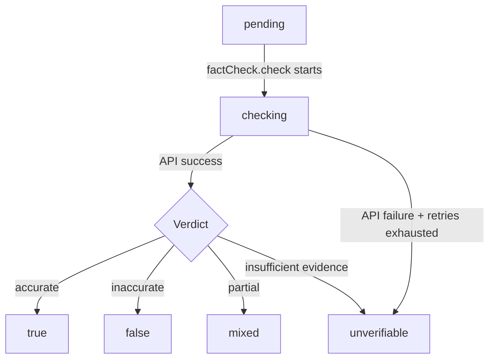
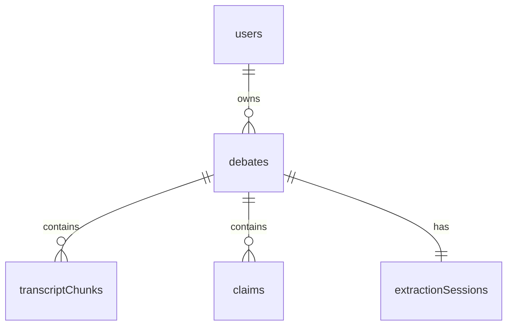

## Overview

Stanzo's data model consists of 4 core tables plus authentication tables provided by Convex Auth. The schema is defined in `convex/schema.ts` using Convex's type-safe schema builder.

```typescript
import { authTables } from "@convex-dev/auth/server"
import { defineSchema, defineTable } from "convex/server"
import { v } from "convex/values"

export default defineSchema({
  ...authTables, // Adds users, authSessions, authAccounts, etc.
  debates: defineTable({ /* ... */ }),
  transcriptChunks: defineTable({ /* ... */ }),
  claims: defineTable({ /* ... */ }),
  extractionSessions: defineTable({ /* ... */ }),
})
```

<Note>
`authTables` from `@convex-dev/auth` automatically adds tables for user accounts, sessions, and OAuth providers. See [Authentication](/guides/authentication) for details.
</Note>

## Table: `debates`

Stores metadata for each debate session.

### Schema

```typescript
debates: defineTable({
  userId: v.id("users"),
  speakerAName: v.string(),
  speakerBName: v.string(),
  status: v.union(v.literal("active"), v.literal("ended")),
  startedAt: v.number(),
  endedAt: v.optional(v.number()),
})
  .index("by_user", ["userId"])
  .index("by_user_and_status", ["userId", "status"])
```

### Fields

| Field | Type | Description |
|-------|------|-------------|
| `userId` | `Id<"users">` | Owner of the debate (foreign key) |
| `speakerAName` | `string` | Name of first speaker |
| `speakerBName` | `string` | Name of second speaker |
| `status` | `"active" \| "ended"` | Current debate state |
| `startedAt` | `number` | Unix timestamp (ms) when debate started |
| `endedAt` | `number?` | Unix timestamp (ms) when debate ended |

### Indexes

- **`by_user`**: Enables fast lookup of all debates for a user
- **`by_user_and_status`**: Optimized for queries like "get active debates for user"

### Relationships

- **One-to-many** with `transcriptChunks`: A debate has many transcript chunks
- **One-to-many** with `claims`: A debate has many extracted claims
- **One-to-one** with `extractionSessions`: A debate has one conversation history

### Status Transitions



Once a debate is ended, it cannot be reactivated.

## Table: `transcriptChunks`

Stores transcript segments from the debate audio.

### Schema

```typescript
transcriptChunks: defineTable({
  debateId: v.id("debates"),
  speaker: v.union(v.literal(0), v.literal(1)),
  text: v.string(),
  startTime: v.number(),
  endTime: v.number(),
  processedForClaims: v.boolean(),
})
  .index("by_debate", ["debateId"])
  .index("by_debate_and_time", ["debateId", "startTime"])
  .index("by_debate_unprocessed", ["debateId", "processedForClaims"])
```

### Fields

| Field | Type | Description |
|-------|------|-------------|
| `debateId` | `Id<"debates">` | Parent debate (foreign key) |
| `speaker` | `0 \| 1` | Which speaker: 0 = speaker A, 1 = speaker B |
| `text` | `string` | Transcribed text content |
| `startTime` | `number` | Start timestamp (ms) within debate |
| `endTime` | `number` | End timestamp (ms) within debate |
| `processedForClaims` | `boolean` | Whether this chunk has been sent to claim extraction |

### Indexes

- **`by_debate`**: Get all chunks for a debate
- **`by_debate_and_time`**: Get chunks in chronological order
- **`by_debate_unprocessed`**: Efficiently find chunks that need claim extraction

<Tip>
The `by_debate_unprocessed` compound index on `[debateId, processedForClaims]` allows fast queries for unprocessed chunks without scanning the entire table.
</Tip>

### Utterance Boundaries

Each chunk represents a **continuous utterance** from one speaker. When the speaker changes or there's a significant pause, a new chunk is created. This helps the AI understand:
- Who said what
- Natural conversation flow
- Context for pronoun resolution

### Processing Workflow

1. Chunk inserted with `processedForClaims: false`
2. Claim extraction queries for unprocessed chunks
3. Chunks marked `processedForClaims: true` **before** LLM call to prevent duplicates
4. Chunks remain in database for full transcript history

## Table: `claims`

Stores extracted factual claims and their verification results.

### Schema

```typescript
claims: defineTable({
  debateId: v.id("debates"),
  speaker: v.union(v.literal(0), v.literal(1)),
  claimText: v.string(),
  originalTranscriptExcerpt: v.string(),
  status: v.union(
    v.literal("pending"),
    v.literal("checking"),
    v.literal("true"),
    v.literal("false"),
    v.literal("mixed"),
    v.literal("unverifiable"),
  ),
  verdict: v.optional(v.string()),
  correction: v.optional(v.string()),
  sources: v.optional(v.array(v.string())),
  extractedAt: v.number(),
  checkedAt: v.optional(v.number()),
})
  .index("by_debate", ["debateId"])
  .index("by_debate_and_status", ["debateId", "status"])
  .index("by_status", ["status"])
```

### Fields

| Field | Type | Description |
|-------|------|-------------|
| `debateId` | `Id<"debates">` | Parent debate (foreign key) |
| `speaker` | `0 \| 1` | Which speaker made the claim |
| `claimText` | `string` | Extracted factual claim |
| `originalTranscriptExcerpt` | `string` | Quote from transcript where claim was found |
| `status` | Status enum | Current verification state (see below) |
| `verdict` | `string?` | Explanation of fact-check result |
| `correction` | `string?` | Correct information (if claim was false/mixed) |
| `sources` | `string[]?` | URLs of sources used for verification |
| `extractedAt` | `number` | Unix timestamp (ms) when claim was extracted |
| `checkedAt` | `number?` | Unix timestamp (ms) when fact-check completed |

### Status Enum

Claims progress through these states:

| Status | Description |
|--------|-------------|
| `pending` | Claim extracted, waiting for fact-check to start |
| `checking` | Fact-check in progress (API call to Perplexity) |
| `true` | Claim verified as accurate |
| `false` | Claim verified as false (correction provided) |
| `mixed` | Claim partially true (correction explains nuance) |
| `unverifiable` | Insufficient evidence to verify |

### Status Transitions



<Warning>
If fact-checking fails after all retries, the claim is marked `unverifiable` with a fallback verdict. This prevents claims from getting stuck in the `checking` state.
</Warning>

### Indexes

- **`by_debate`**: Get all claims for a debate
- **`by_debate_and_status`**: Filter claims by status (e.g., show only false claims)
- **`by_status`**: Global queries across all debates (e.g., admin dashboard)

## Table: `extractionSessions`

Stores conversation history for claim extraction AI.

### Schema

```typescript
extractionSessions: defineTable({
  debateId: v.id("debates"),
  messages: v.array(
    v.object({
      role: v.union(v.literal("user"), v.literal("model")),
      content: v.string(),
    }),
  ),
}).index("by_debate", ["debateId"])
```

### Fields

| Field | Type | Description |
|-------|------|-------------|
| `debateId` | `Id<"debates">` | Parent debate (foreign key) |
| `messages` | `Message[]` | Conversation history with AI |

### Message Format

Each message has:
- **`role`**: `"user"` (transcript chunks) or `"model"` (AI responses)
- **`content`**: The actual text content

### Purpose

This table allows the claim extraction AI to maintain context across multiple extraction runs:

```typescript
// Load existing history
const session = await ctx.runQuery(
  internal.extractionSessions.getByDebate,
  { debateId: args.debateId },
)
const existingMessages = session?.messages ?? []

// Add new transcript chunks as user message
const messages = [
  ...existingMessages,
  { role: "user", content: newTranscriptChunks },
]

// After AI responds, save updated history
await ctx.runMutation(internal.extractionSessions.upsert, {
  debateId: args.debateId,
  messages: [...messages, { role: "model", content: aiResponse }],
})
```

This enables:
- **Pronoun resolution**: "He said X" → AI knows who "he" refers to
- **No re-extraction**: AI remembers previous claims and doesn't duplicate
- **Context awareness**: AI understands debate flow and references

<Note>
There is a 1:1 relationship between debates and extraction sessions. Each debate has exactly one conversation history that grows over time.
</Note>

## Relationships Diagram



## Query Patterns

### Get all data for a debate

```typescript
const debate = await ctx.db.get(debateId)
const chunks = await ctx.db
  .query("transcriptChunks")
  .withIndex("by_debate_and_time", (q) => q.eq("debateId", debateId))
  .collect()
const claims = await ctx.db
  .query("claims")
  .withIndex("by_debate", (q) => q.eq("debateId", debateId))
  .collect()
```

### Get pending claims

```typescript
const pendingClaims = await ctx.db
  .query("claims")
  .withIndex("by_debate_and_status", (q) =>
    q.eq("debateId", debateId).eq("status", "pending")
  )
  .collect()
```

### Get unprocessed chunks

```typescript
const unprocessed = await ctx.db
  .query("transcriptChunks")
  .withIndex("by_debate_unprocessed", (q) =>
    q.eq("debateId", debateId).eq("processedForClaims", false)
  )
  .collect()
```

<Tip>
Always use indexes for queries. Convex optimizes indexed queries to O(log n + k) where k is the result size, compared to O(n) for full table scans.
</Tip>
