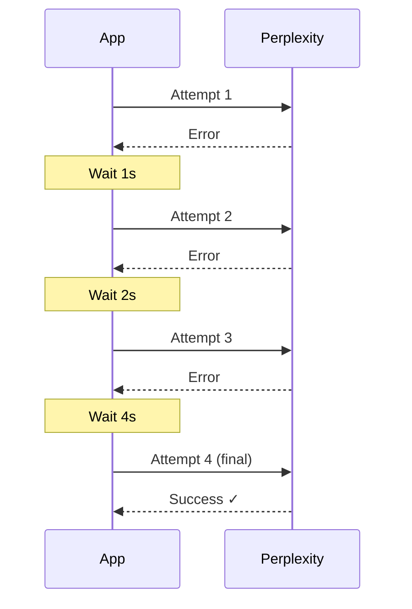
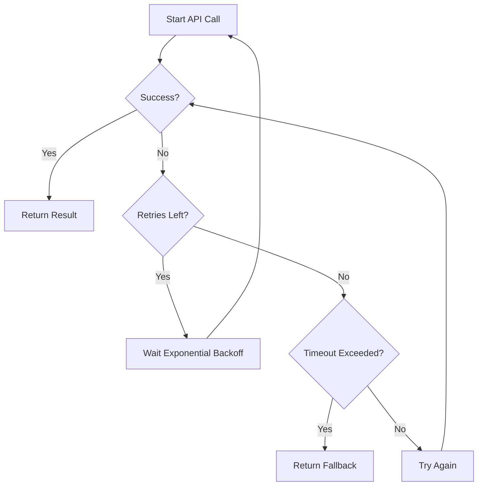

## Overview

Stanzo uses the [Effect](https://effect.website/) library to handle errors, retries, and timeouts when calling external APIs. Effect provides:

- **Type-safe error handling** with custom error types
- **Retry schedules** with exponential backoff
- **Timeouts** to prevent hung operations
- **Fallback handling** when all retries fail

<Note>
Effect is a functional programming library for TypeScript that makes error handling composable and type-safe. It's similar to `Promise` but with explicit error types.
</Note>

## Why Effect?

Compare traditional error handling:

```typescript
// Traditional approach
try {
  const response = await fetch(url)
  const data = await response.json()
  return data
} catch (error) {
  console.error("Failed:", error)
  // What type of error? Network? Parse? Unknown?
  return null
}
```

With Effect:

```typescript
// Effect approach
const result = await Effect.runPromise(
  Effect.tryPromise({
    try: () => fetch(url).then(r => r.json()),
    catch: (e) => new ApiError({ message: String(e) })
  })
    .pipe(Effect.retry(exponentialBackoff))
    .pipe(Effect.timeout(Duration.seconds(30)))
    .pipe(Effect.catchAll(() => Effect.succeed(fallbackValue)))
)
```

Effect's advantages:
- Errors are **typed** (`ApiError` in this case)
- Retries and timeouts are **declarative**
- Fallback logic is **composable**
- The type system **prevents uncaught errors**

## Fact-Checking with Retries

Let's examine how `convex/factCheck.ts` uses Effect to call the Perplexity API:

### 1. Define Error Type

```typescript
import { Data } from "effect"

class PerplexityApiError extends Data.TaggedError("PerplexityApiError")<{
  message: string
}> {}
```

This creates a custom error type that:
- Is tagged with `"PerplexityApiError"` for pattern matching
- Contains a `message` field
- Can be distinguished from other error types

### 2. Wrap API Call

```typescript
const callPerplexity = (apiKey: string, claimText: string) =>
  Effect.gen(function* () {
    const client = new Perplexity({ apiKey })

    const response = yield* Effect.tryPromise({
      try: () =>
        client.chat.completions.create({
          model: "sonar",
          messages: [
            {
              role: "system",
              content: "You are a fact-checker. Evaluate the following claim...",
            },
            {
              role: "user",
              content: `Fact-check this claim: "${claimText}"`,
            },
          ],
        }),
      catch: (e) => new PerplexityApiError({ message: String(e) }),
    })

    // Parse and validate response...
  })
```

**Key points:**
- `Effect.gen` creates an effect using generator syntax (similar to async/await)
- `Effect.tryPromise` wraps the Promise-based API call
- Any error is transformed into `PerplexityApiError`
- The function returns an `Effect<Result, PerplexityApiError>` (not a Promise)

### 3. Add Retry Logic

```typescript
const callPerplexity = (apiKey: string, claimText: string) =>
  Effect.gen(function* () {
    // ... API call
  }).pipe(
    Effect.retry({
      schedule: Schedule.exponential(Duration.seconds(1)).pipe(
        Schedule.intersect(Schedule.recurs(3)),
      ),
      while: (e) => e instanceof PerplexityApiError,
    }),
    Effect.timeout(Duration.seconds(30)),
  )
```

**Retry configuration:**

| Parameter | Value | Description |
|-----------|-------|-------------|
| Initial delay | 1 second | First retry waits 1s |
| Backoff | Exponential | Delays: 1s, 2s, 4s |
| Max retries | 3 | Total of 4 attempts (initial + 3 retries) |
| Retry condition | `PerplexityApiError` | Only retry on API errors |
| Total timeout | 30 seconds | Entire operation must complete within 30s |

<Tip>
**Exponential backoff** prevents overwhelming the API during outages. Each retry waits twice as long as the previous one.
</Tip>

### Retry Timeline

Here's how retries play out:



If all 4 attempts fail or 30 seconds elapse, the timeout fires.

### 4. Fallback Handling

When retries are exhausted, provide a fallback result:

```typescript
const fallbackResult = {
  status: "unverifiable" as const,
  verdict: "Could not parse result",
  correction: undefined,
}

const factCheck = await Effect.runPromise(
  callPerplexity(apiKey, claim.claimText).pipe(
    Effect.catchAll((e) => {
      console.error("Fact check failed:", e)
      return Effect.succeed({
        ...fallbackResult,
        citations: [] as string[],
      })
    }),
  ),
)
```

**How it works:**
- `Effect.catchAll` catches any error (after retries are exhausted)
- Logs the error for debugging
- Returns a successful effect with `status: "unverifiable"`
- The claim is marked as unverifiable rather than stuck in "checking" state

<Warning>
Without fallback handling, claims could get stuck in the `"checking"` state if the API is down. Always provide a fallback.
</Warning>

## Claim Extraction Timeouts

The claim extraction pipeline (`convex/claimExtraction.ts`) also uses timeouts:

```typescript
const streamClaims = (
  apiKey: string,
  systemPrompt: string,
  messages: Message[],
  onClaim: (claim: ClaimData) => Promise<void>,
) =>
  Effect.tryPromise({
    try: async () => {
      const client = new GoogleGenAI({ apiKey })
      const stream = await client.models.generateContentStream({ /* ... */ })

      let buffer = ""
      for await (const chunk of stream) {
        buffer += chunk.text ?? ""
        // Process claims from buffer...
      }
    },
    catch: (e) => new GeminiApiError({ message: String(e) }),
  }).pipe(Effect.timeout(Duration.seconds(60)))
```

**Differences from fact-checking:**
- **No retries**: Claim extraction is idempotent (chunks are marked processed before calling the LLM), so retrying isn't beneficial
- **Longer timeout**: 60 seconds vs 30 seconds, because streaming can take longer
- **Error handling**: Errors are caught and logged, but extraction silently fails (convex/claimExtraction.ts:151)

```typescript
const result = await Effect.runPromise(
  streamClaims(apiKey, systemPrompt, messages, onClaim).pipe(
    Effect.catchAll((e) => {
      console.error("Claim extraction failed:", e)
      return Effect.succeed(undefined) // Return undefined on failure
    }),
  ),
)
```

If extraction fails, the chunks remain marked as processed to prevent infinite retries. The frontend can manually re-trigger extraction if needed.

## Schema Validation

Effect integrates with its `Schema` library for runtime validation:

```typescript
import { Schema } from "effect"

const FactCheckResultSchema = Schema.Struct({
  status: Schema.Union(
    Schema.Literal("true"),
    Schema.Literal("false"),
    Schema.Literal("mixed"),
    Schema.Literal("unverifiable"),
  ),
  verdict: Schema.String,
  correction: Schema.optional(Schema.NullOr(Schema.String)),
})
```

Parsing API responses with fallback:

```typescript
const result = yield* Schema.decodeUnknown(FactCheckResultSchema)(
  parsed,
).pipe(Effect.catchAll(() => Effect.succeed(fallbackResult)))
```

This ensures:
- API responses are validated at runtime
- Invalid responses don't crash the app
- Type safety is maintained even with external data

<Note>
Effect's `Schema` is similar to Zod but integrates with Effect's error handling. It provides:
- Runtime type checking
- Automatic type inference
- Composable transformations
</Note>

## Best Practices

### 1. Always Set Timeouts

Every external API call should have a timeout:

```typescript
Effect.tryPromise({ /* ... */ })
  .pipe(Effect.timeout(Duration.seconds(30)))
```

Without timeouts, hung requests can accumulate and exhaust resources.

### 2. Use Exponential Backoff

For retries, always use exponential backoff:

```typescript
Schedule.exponential(Duration.seconds(1)).pipe(
  Schedule.intersect(Schedule.recurs(3)),
)
```

Linear backoff (1s, 1s, 1s) can overwhelm recovering services.

### 3. Retry Only Transient Errors

Only retry errors that might succeed on retry:

```typescript
Effect.retry({
  schedule: /* ... */,
  while: (e) => e instanceof NetworkError, // Don't retry validation errors
})
```

### 4. Provide Fallbacks

Always handle the case where all retries fail:

```typescript
Effect.catchAll((e) => {
  console.error("Operation failed:", e)
  return Effect.succeed(fallbackValue)
})
```

This prevents errors from propagating to the frontend.

### 5. Log Errors

Log errors before swallowing them:

```typescript
Effect.catchAll((e) => {
  console.error("Fact check failed:", e) // Important for debugging!
  return Effect.succeed(fallbackResult)
})
```

Convex logs are visible in the dashboard, making debugging easier.

## Error Flow Diagram



## Running Effects

Effect types aren't Promises, so they need to be run:

```typescript
// Convert Effect to Promise
const result = await Effect.runPromise(myEffect)

// Sync execution (only for pure effects)
const result = Effect.runSync(myEffect)
```

<Warning>
`runPromise` will throw if the effect fails and isn't caught. Always use `catchAll` before running effects in production.
</Warning>

## Common Patterns

### Pattern: API Call with Retry + Timeout + Fallback

```typescript
const result = await Effect.runPromise(
  Effect.tryPromise({
    try: () => apiCall(),
    catch: (e) => new ApiError({ message: String(e) }),
  })
    .pipe(
      Effect.retry({
        schedule: Schedule.exponential(Duration.seconds(1)).pipe(
          Schedule.intersect(Schedule.recurs(3)),
        ),
      }),
    )
    .pipe(Effect.timeout(Duration.seconds(30)))
    .pipe(
      Effect.catchAll((e) => {
        console.error("API call failed:", e)
        return Effect.succeed(fallbackValue)
      }),
    ),
)
```

### Pattern: Streaming with Timeout

```typescript
const result = await Effect.runPromise(
  Effect.tryPromise({
    try: async () => {
      for await (const chunk of stream) {
        await processChunk(chunk)
      }
    },
    catch: (e) => new StreamError({ message: String(e) }),
  })
    .pipe(Effect.timeout(Duration.seconds(60)))
    .pipe(Effect.catchAll(() => Effect.succeed(undefined))),
)
```

### Pattern: Schema Validation with Fallback

```typescript
const validated = yield* Schema.decodeUnknown(MySchema)(data).pipe(
  Effect.catchAll(() => Effect.succeed(defaultValue)),
)
```
